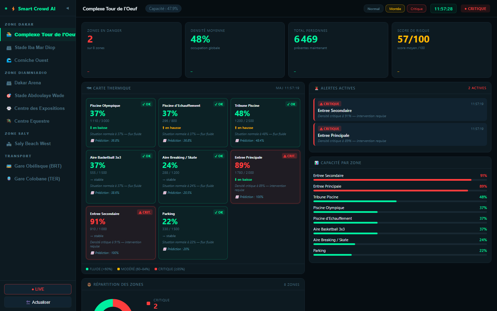
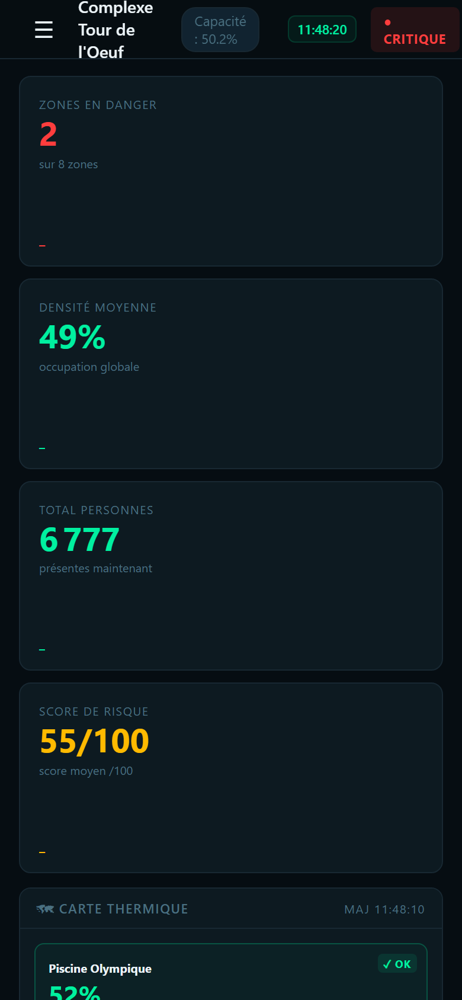

<div align="center">

# ⚡ Smart Crowd AI

### Surveillance intelligente de l'affluence en temps réel
#### Jeux Olympiques de la Jeunesse — Dakar 2026

[](https://python.org)
[](https://flask.palletsprojects.com/)
[](https://smart-crowd-alert.onrender.com)
[](https://github.com/chniang/SMART_CROWD_ALERT)
[](https://github.com/chniang/SMART_CROWD_ALERT/actions/workflows/tests.yml)

*Projet initié lors du Hackathon JOJ Innovation Challenge (SONATEL × Orange Digital Center Mermoz, avril 2026), poursuivi en développement personnel.*

</div>

---

## Le problème

Les accidents de foule font des victimes chaque année dans le monde entier.
**Hillsborough (1989, 96 morts). La Mecque (2015, 2 426 morts). Seoul (2022, 159 morts).**
Ces catastrophes avaient toutes un point commun : la zone critique était détectable plusieurs minutes avant l'incident. Personne ne l'a vu venir — parce qu'il n'existait pas d'outil pour regarder.

Les JOJ Dakar 2026 représentent le **premier événement olympique sur le sol africain**.
70 000+ spectateurs. 10 sites de compétition répartis sur 3 zones géographiques.
Des flux de transport massifs via le BRT et le TER. Une organisation sécuritaire qui ne peut pas se permettre l'improvisation.

Les organisateurs font face à trois angles morts critiques :

- **Visibilité fragmentée** — aucune vue unifiée et temps réel sur l'ensemble des sites
- **Réaction tardive** — les interventions arrivent après saturation, quand la fenêtre d'action est fermée
- **Données en silos** — billetterie, agents terrain, transport : des sources qui ne se parlent pas

## La solution

**Smart Crowd AI** est un système de surveillance intelligente de l'affluence conçu spécifiquement pour les JOJ Dakar 2026 et les grands événements africains.

```
Détection  ──►  Analyse  ──►  Alerte  ──►  Action terrain
    📡              ⚙             🚨              🦺
  Sources       Score         Confirmée        Agent
  hybrides    composite       3 cycles        informé
```

En moins de 5 secondes, les coordinateurs de sécurité savent quelle zone est en tension,
pourquoi elle l'est, ce qu'elle va devenir, et quoi faire.

---

## Table des matières

1. [Sites et zones surveillés](#1-sites-et-zones-surveillés)
2. [Architecture du système](#2-architecture-du-système)
3. [Logique d'alerte et score de risque](#3-logique-dalerte-et-score-de-risque)
4. [Fonctionnalités du dashboard](#4-fonctionnalités-du-dashboard)
5. [Application mobile terrain](#5-application-mobile-terrain)
6. [Sources de données](#6-sources-de-données)
7. [Prédiction par Machine Learning](#7-prédiction-par-machine-learning)
8. [État du MVP](#8-état-du-mvp)
9. [Installation et démarrage](#9-installation-et-démarrage)
10. [Déploiement production](#10-déploiement-production)
11. [Limites actuelles](#11-limites-actuelles)
12. [Perspectives et roadmap](#12-perspectives-et-roadmap)

---

## 1. Sites et zones surveillés

10 sites officiels répartis sur 3 zones géographiques du Sénégal.

### Zone Dakar — 3 sites

| Site | Sports | Zones surveillées |
|------|--------|-------------------|
| 🏊 **Complexe Tour de l'Oeuf** | Natation, Basketball 3x3, Breaking, Baseball5, Skateboard | Piscine Olympique, Tribune, Aire Breaking/Skate, Entrées (×2), Parking |
| 🏟 **Stade Iba Mar Diop** | Athlétisme, Boxe, Futsal, Rugby à 7 | Tribunes (×4), Piste, Salle de Boxe, Entrée Principale, Parking |
| 🌊 **Corniche Ouest** | Cyclisme sur route, 10 sports d'engagement | Zones Départ/Arrivée Cyclo, Plages (×2), VIP/Médias, Entrée, Parking |

### Zone Diamniadio — 4 sites

| Site | Sports | Zones surveillées |
|------|--------|-------------------|
| 🏟 **Dakar Arena** | Badminton, Futsal | Secteurs A/B/C/D, Aire Badminton, Entrée Principale, Parking |
| 🎯 **Stade Abdoulaye Wade** | Tir à l'arc, Cérémonie d'ouverture | Tribunes (×4), Aire Tir à l'arc, Zone VIP Cérémonie, Entrées (×2), Parking |
| 🥋 **Centre des Expositions** | Escrime, Gym artistique, Judo, Taekwondo, Tennis de table, Wushu | Halls A/B/C/D, Tribune Centrale, Entrée, Parking |
| 🏇 **Centre Equestre Gendarmerie** | Saut d'obstacles | Piste Principale, Tribunes (×2), Paddock, VIP, Entrée, Parking |

### Zone Saly — 1 site

| Site | Sports | Zones surveillées |
|------|--------|-------------------|
| 🏖 **Saly Beach West** | Beach Handball, Beach Volleyball, Beach Wrestling, Aviron de mer, Voile, Triathlon | Plages Volley/Handball et Triathlon, Zone Voile, Zone Spectateurs, VIP/Médias, Entrées (×2), Parking |

### Transport — 2 sites

| Site | Type | Zones surveillées |
|------|------|-------------------|
| 🚌 **Gare Obélisque (BRT)** | Bus Rapid Transit | Portes A/B/C, Quais Départ/Arrivée, Hall Principal, Billetterie, Parking Relais |
| 🚆 **Gare Colobane (TER)** | Train Express Régional | Quais 1/2, Hall Accueil, Zone Contrôle, Sorties (×2), Zone Attente, Parking TER |

> **Total : 10 sites · 80+ zones · 3 zones géographiques · Dakar → Diamniadio → Saly**

---

## 2. Architecture du système

### Vue d'ensemble

```
┌─────────────────────────────────────────────────────────────────────┐
│                        SMART CROWD AI                               │
├──────────────────┬──────────────────────────┬───────────────────────┤
│   Sources data   │      Backend Flask       │      Interfaces       │
│                  │                          │                       │
│  Antennes Orange │  /api/refresh            │  Dashboard Web 🖥     │
│  Compteurs IoT   │  /api/lieu?lieu=X        │  App Mobile 📱        │
│  WiFi indoor     │  /api/scenario?mode=X    │                       │
│  Billetterie     │                          │                       │
│                  │  ZONE_HISTORY (10 pts)   │  localStorage cache   │
│  ↕ MVP :         │  compute_risk_score()    │  (mode offline)       │
│  simulation      │  predict_densite()       │                       │
│  calibrée        │  (LSTM numpy, zéro TF)   │                       │
└──────────────────┴──────────────────────────┴───────────────────────┘
```

### Structure du projet

```
SMART_CROWD_ALERT/
├── server.py              ← Point d'entrée Flask (port 5000)
├── dashboard.html         ← Interface web complète (HTML/CSS/JS)
├── data.json              ← Cache temps réel (+ persistance ZONE_HISTORY)
├── requirements.txt       ← flask, flask-cors, gunicorn, numpy
├── Procfile               ← Configuration déploiement Render
├── README.md
├── core/
│   ├── data_provider.py        ← Abstraction sources (Orange/IoT/WiFi)
│   ├── simulation.py           ← Simulation calibrée sur profils horaires
│   ├── historical_generator.py ← Générateur historique 30 jours (ML)
│   ├── prediction.py           ← Inférence LSTM numpy pure
│   └── models/                 ← Poids LSTM exportés (~93 KB)
├── notebook/
│   └── prediction_densite.ipynb ← EDA + entraînement LSTM
└── assets/
    ├── dashboard_preview.png
    └── dashboard_mobile.png
```

### Endpoints API

| Route | Description | Réponse |
|-------|-------------|---------|
| `GET /` | Dashboard HTML | Interface complète |
| `GET /api/refresh` | Recalcul tous les sites | JSON tous sites |
| `GET /api/lieu?lieu=X` | Données d'un site | JSON zones du site |
| `GET /api/scenario?mode=X` | Changer scénario | `normal` / `montee` / `critique` |

### Format de réponse par zone

```json
{
  "zone": "Tribune Nord",
  "capacite": 10000,
  "personnes": 8700,
  "densite": 87,
  "trend": "hausse_rapide",
  "trend_label": "hausse rapide",
  "trend_icon": "⬆⬆",
  "status": "danger",
  "risk_score": 100,
  "risk_reason": "Densité 87% + hausse rapide — risque critique",
  "predicted_densite": 91.4,
  "alert_status": "confirmée",
  "taux_remplissage_site": 71.2,
  "time": "18:05:14"
}
```

---

## 3. Logique d'alerte et score de risque

### Score composite (0 à 100)

Le score de risque n'est pas un seuil binaire. Il intègre 4 facteurs contextuels :

```python
def compute_risk_score(densite, trend, heure, zone_name):
    score = densite

    # 1. Bonus tendance — la vitesse d'évolution compte autant que le niveau
    if trend == 'hausse_rapide': score += 15
    elif trend == 'hausse':      score += 8

    # 2. Bonus heure de pointe — contexte temporel de l'événement
    if heure in [9, 10, 14, 15, 18, 19, 20]: score += 10
    elif heure in [11, 16]:                   score += 5

    # 3. Bonus zone sensible — certaines zones sont structurellement plus risquées
    if 'Entree' in zone_name or 'Porte' in zone_name: score += 10
    elif 'Quai' in zone_name or 'Sortie' in zone_name: score += 8
    elif 'Parking' in zone_name:                       score += 3

    return min(100, score)
```

**Exemple concret :**
Une Entrée Principale à 74% en hausse rapide à 18h = 74 + 15 + 10 + 10 = **99/100**
→ Alerte déclenchée **avant** d'atteindre 85%
→ Une tribune à 80% stable à 14h = 80 + 0 + 10 = **90/100** → même priorité plus basse

### Seuils de statut

| Statut | Seuil densité | Couleur | Signification opérationnelle |
|--------|--------------|---------|------------------------------|
| FLUIDE | < 60% | 🟢 Vert | Flux normal — surveillance standard |
| MODÉRÉ | 60 à 84% | 🟡 Ambre | Tension détectée — vigilance renforcée |
| CRITIQUE | ≥ 85% | 🔴 Rouge | Saturation — intervention immédiate |

### Confirmation anti faux-positifs

```python
# Une alerte n'est confirmée qu'après persistance temporelle
confirmed   = all(h >= 85 for h in hist[-3:])  # 3 cycles consecutifs = CONFIRMEE
observation = all(h >= 60 for h in hist[-2:])  # 2 cycles consecutifs = EN OBSERVATION
```

Un pic de 30 secondes ne déclenche pas d'alerte confirmée.
Cela évite les faux positifs qui épuisent la vigilance des agents.

### Prédiction de trajectoire

La densité du prochain cycle est prédite par un modèle LSTM entraîné sur 115 200 points
historiques simulés. Après 10 cycles de collecte (environ 50 secondes en mode LIVE),
le modèle prend le relais de la régression linéaire initiale.
Voir [Section 7 — Prédiction par Machine Learning](#7-prédiction-par-machine-learning).

### Scénarios de démonstration

| Scénario | Comportement | Usage |
|----------|-------------|-------|
| `normal` | Profil horaire calibré (facteur 0.3 à 0.9 selon heure) | Présentation baseline |
| `montee` | Base +18%, simule l'arrivée des spectateurs | Montée progressive |
| `critique` | Zones d'entrée forcées à 88-98% | Démo alertes critiques |

---

## 4. Fonctionnalités du dashboard

### Vue d'ensemble — Scénario Critique

**Desktop**


**Mobile (390px) — sidebar drawer, KPIs empilés**


### KPIs temps réel

Quatre indicateurs en haut de l'interface, mis à jour à chaque cycle :

| KPI | Description | Couleur |
|-----|-------------|---------|
| Zones en danger | Zones avec densité ≥ 85% | Rouge si > 0 |
| Densité moyenne | Moyenne toutes zones du site actif | Rouge/Ambre/Vert |
| Total personnes | Somme des présences sur le site | Vert |
| Score de risque | Score composite moyen 0-100 | Rouge/Ambre/Gris |

Chaque KPI affiche une **sparkline** (courbe des 10 dernières valeurs) et un **delta** tendanciel.

### Carte thermique

Chaque zone-card affiche en temps réel :
- Statut coloré (OK / MOD. / CRIT.) avec animation pulse si critique
- Densité en grand format coloré
- Personnes présentes sur capacité maximale
- Tendance avec icônes (⬆⬆ / ⬆ / → / ⬇ / ⬇⬇)
- Message contextuel en langage naturel généré automatiquement
- Prédiction pour le prochain cycle (LSTM après 10 cycles, régression linéaire avant)
- Badge EN OBSERVATION ou ALERTE CONFIRMÉE si applicable

### Système d'alertes

- Triées par criticité (CRITIQUE en premier, ATTENTION ensuite)
- Message précis généré automatiquement (zone + densité + tendance + raison)
- Horodatage exact
- Confirmation après 3 cycles consécutifs

### Graphiques et visualisations

- **Sparklines KPI** — évolution sur 10 cycles avec gradient coloré
- **Courbe densité** — avec seuils visuels 60% et 85% annotés
- **Donut répartition** — fluide / modéré / critique en temps réel
- **Barres horizontales** — classement zones par densité décroissante

### Navigation et résilience

- **Sidebar collapsible** — 10 sites groupés par zone géographique avec icônes
- **Mode LIVE** — rafraîchissement automatique toutes les 5 secondes
- **Mode offline** — cache localStorage par site, badge HORS LIGNE horodaté
- **Badge capacité globale** — taux de remplissage du site dans la topbar

---

## 5. Application mobile terrain

> **Statut actuel : maquette de démonstration** (fichier HTML dynamique).
> Non connectée au backend. Pas une application native.

L'application mobile est conçue pour les **agents de sécurité sur le terrain** :
lecture rapide, décision rapide, une main sur le téléphone.

### Écrans disponibles

| Écran | Contenu | Usage terrain |
|-------|---------|---------------|
| 📊 Dashboard | KPIs × 4, sélecteur 10 sites, donut, liste zones | Vue globale instantanée |
| 🚨 Alertes | Liste CRITIQUE/ATTENTION triée, messages contextuels | Action immédiate |
| 🔍 Zone critique | Densité, historique, prédiction, zones alternatives | Décision de redirection |
| 📡 SMS Sonatel | Inscription alertes, aperçu SMS automatique | Notification spectateurs |
| 👤 Profil | Site assigné, toggles notifications, stats session | Configuration agent |

### Cohérence avec le dashboard

Mêmes statuts · mêmes scores · mêmes 10 sites · mêmes tendances · même logique d'alerte

### Vision production

Application React Native native, notifications push Firebase, authentification badge JOJ,
mode offline avec Redux Persist, consommant la même API Flask.

---

## 6. Sources de données

### Architecture hybride cible

Notre système est conçu pour être **source-agnostique**.
La simulation actuelle est remplaçable sans modifier l'architecture sous-jacente.

```
MVP (aujourd'hui)          Production (vision)
─────────────────          ──────────────────────────────────
Simulation calibrée   →    Antennes Orange/Sonatel (macro)
                      →    Compteurs IoT aux entrées (micro)
                      →    WiFi Orange indoor (granulaire)
                      →    Billetterie JOJ (référentiel)
         ↓                          ↓
    API Flask              API Flask (même architecture)
         ↓                          ↓
   Dashboard + App         Dashboard + App (identiques)
```

### Détail des sources

#### Antennes réseau mobile — Source principale

Orange voit en temps réel combien d'appareils sont connectés à chaque cellule.

| | |
|--|--|
| Précision | 200m à 2km selon type d'antenne |
| Avantage | Infrastructure existante, ~90% des spectateurs couverts |
| Limite | Surveillance macro par site — ne distingue pas les zones internes |
| Accès | API Orange Data for Society ou accord Sonatel/JOJ |
| Dans le MVP | Simulé par `get_zone_base()` avec profil horaire calibré |

#### Compteurs IoT aux entrées — Précision zone

Capteurs aux tourniquets comptant les flux entrants et sortants.

| | |
|--|--|
| Précision | Moins de 5 mètres — zone physique précise |
| Avantage | Densité exacte par zone, flux en temps réel |
| Limite | Installation physique requise avant l'événement |
| Dans le MVP | Simulé avec biais par type de zone |

#### WiFi Orange indoor — Granularité fine

| | |
|--|--|
| Précision | 20 à 50 mètres indoor |
| Usage | Halls de gares, arènes couvertes, centres d'exposition |
| Dans le MVP | Cité en roadmap, non simulé |

#### Billetterie JOJ — Référentiel capacité

| | |
|--|--|
| Usage | Capacité maximale autorisée et attendance attendue par zone |
| Dans le MVP | Capacités fixes intégrées dans le dictionnaire `LIEUX` |

### Interface d'abstraction — le vrai code

L'architecture source-agnostique repose sur `core/data_provider.py`.
Pour connecter l'API Orange : une seule fonction à implémenter, rien d'autre ne change.

```python
# core/data_provider.py — interface réelle en production

def get_densite(zone_config: dict, scenario: str, heure: int, previous: float) -> int:
    """
    Point d'entrée unique. Dispatche selon zone_config["source"].
    """
    source = zone_config.get("source", "simulation")

    if source == "orange_antenna":
        return _fetch_orange_antenna(zone_config, scenario, heure)
    elif source == "iot_counter":
        return _fetch_iot_counter(zone_config, scenario, heure)
    elif source == "wifi_hotspot":
        return _fetch_wifi_hotspot(zone_config, scenario, heure)
    else:
        return _simulate(zone_config, scenario, heure)


def _fetch_orange_antenna(zone_config: dict, scenario: str, heure: int) -> int:
    """
    TODO V2 : Appel API Orange Network Analytics
    Endpoint cible : GET /network-analytics/crowd-density

    Exemple futur :
        response = requests.get(
            ORANGE_API_URL,
            params={"lat": zone_config["lat"], "lng": zone_config["lng"]},
            headers={"Authorization": f"Bearer {ORANGE_API_KEY}"}
        )
        return response.json()["density_percent"]
    """
    return _simulate(zone_config, scenario, heure)   # MVP : simulation
```

**L'architecture Flask, les alertes, le dashboard : rien ne change quand on branche les vraies données.**

---

## 7. Prédiction par Machine Learning

### Pipeline complet

```
core/historical_generator.py
  ↓ génère 115 200 points (80 zones × 30 jours × 48 pts/jour)
  ↓ facteurs : profil horaire, weekend +20%, jours de compétition +45%

notebook/prediction_densite.ipynb
  ↓ EDA : distribution des densités, séries temporelles, jours d'événement
  ↓ Entraînement LSTM(32) → Dense(1) sur 91 360 séquences (80% train)
  ↓ Comparaison baseline régression linéaire (identique au calcul serveur)
  ↓ Export poids numpy dans core/models/

core/prediction.py
  ↓ Inférence LSTM en pur numpy — zéro TensorFlow en production
  ↓ predict_densite(historique) → float
  ↓ Fallback régression linéaire si historique < 10 points
```

### Résultats

Entraîné sur 115 200 points simulés (30 jours, 80 zones), évalué sur 23 040 séquences de test.

| Modèle | MAE (%) | RMSE (%) |
|--------|--------:|--------:|
| Régression linéaire (baseline) | 6.79 | 9.77 |
| LSTM 32 units | **5.88** | **8.08** |
| Gain | **-13.4%** | **-17.3%** |

Le gain est modeste mais honnête — cohérent avec la nature périodique et régulière
des données simulées. La régression linéaire est déjà un bon prédicteur sur des séries lisses.

### Inférence sans TensorFlow en production

Les poids sont exportés en `.npy` (~93 KB au total) et le forward pass est réimplémenté
en numpy pur dans `core/prediction.py`. Render n'installe pas TensorFlow (~500 MB) :
seul `numpy` est requis.

```python
# core/prediction.py — passe avant LSTM en numpy pur
for x_t in seq_norm:
    x = np.array([[x_t]], dtype=np.float32)
    z = x @ W + h @ U + b                    # (1, 4·units)
    i = _sig(z[:, 0*units:1*units])           # input gate
    f = _sig(z[:, 1*units:2*units])           # forget gate
    g = np.tanh(z[:, 2*units:3*units])        # cell gate
    o = _sig(z[:, 3*units:4*units])           # output gate
    c = f * c + i * g
    h = o * np.tanh(c)
out_norm = (h @ Wd + bd).item()              # .item() : compatibilité numpy strict
```

### Rigueur d'ingénierie — un exemple concret

En production (Render, numpy récent), `float(array_2D)` lève `TypeError` alors que
la même ligne fonctionnait en local (numpy permissif). Diagnostic via un endpoint de
debug temporaire, correction en une ligne : `.item()` est shape-agnostique.

Ce type d'écart de comportement entre versions est documenté — c'est précisément
pour ça qu'on teste en production, pas seulement en local.

### Explorer le notebook

[`notebook/prediction_densite.ipynb`](notebook/prediction_densite.ipynb) —
EDA complet, courbes d'apprentissage, comparaison visuelle LSTM vs baseline,
export des poids.

---

## 8. État du MVP

### Ce qui est opérationnel aujourd'hui

| Composant | État | Notes |
|-----------|------|-------|
| Dashboard web | ✅ Opérationnel | [smart-crowd-alert.onrender.com](https://smart-crowd-alert.onrender.com) |
| Backend Flask API | ✅ Opérationnel | 3 endpoints REST (`/api/refresh`, `/api/lieu`, `/api/scenario`) |
| 10 sites JOJ officiels | ✅ Opérationnel | Zones réelles configurées |
| Score de risque composite | ✅ Opérationnel | 4 facteurs : densité + tendance + heure + zone |
| Alertes avec confirmation | ✅ Opérationnel | Anti faux-positifs 3 cycles |
| Prédiction LSTM | ✅ Opérationnel | LSTM 32 units en numpy pur, MAE 5.88% |
| Persistance ZONE_HISTORY | ✅ Opérationnel | Survit aux spin-downs Render via data.json |
| Mode offline | ✅ Opérationnel | Cache localStorage par site |
| 3 scénarios de démo | ✅ Opérationnel | Normal / Montée / Critique |
| Maquette app mobile | ❌ Non incluse | Fichier retiré du repo — vision décrite en section 5 |

### Ce qui n'est pas encore implémenté

| Fonctionnalité | Priorité | Version cible |
|----------------|----------|---------------|
| Connexion API Orange/Sonatel | Haute | V2 |
| Alertes SMS Sonatel réelles | Haute | V2 |
| Application mobile native | Haute | V2 |
| Carte géographique Leaflet | Moyenne | V2 |
| Authentification agents | Moyenne | V2 |
| Entraînement ML sur données réelles | Haute | V2+ |
| Analyse comportementale caméras | Basse | V3 |

---

## 9. Installation et démarrage

### Prérequis

- Python 3.10+
- pip

### Installation

```bash
git clone https://github.com/chniang/SMART_CROWD_ALERT.git
cd SMART_CROWD_ALERT
pip install -r requirements.txt
python server.py
```

Ouvrir : **http://localhost:5000** — ou directement la démo live : **https://smart-crowd-alert.onrender.com**

### Démo en 30 secondes

1. Sélectionner **Stade Abdoulaye Wade** dans la sidebar
2. Activer **Mode LIVE** (bouton rouge en bas de sidebar)
3. Cliquer **Critique** dans la topbar
4. Observer les alertes se déclencher en temps réel

### Accès distant avec ngrok

```bash
ngrok http 5000
# Partager l'URL générée — les modifications locales sont reflétées en temps réel
```

---

## 10. Déploiement production

### Déploiement Render (actuel)

Le projet est déployé en continu sur **Render Web Service free tier** via GitHub.

**URL publique :** [https://smart-crowd-alert.onrender.com](https://smart-crowd-alert.onrender.com)

```
# Procfile
web: gunicorn server:app --bind 0.0.0.0:$PORT --workers 1
```

```
# requirements.txt
flask
flask-cors
gunicorn
numpy
```

**Note `--workers 1` :** Render free tier alloue 512 MB de RAM. Gunicorn lance par
défaut `2 × CPU + 1 = 3` workers. Avec numpy (~100 MB par worker), la limite mémoire
est dépassée dès que le LSTM s'active. Un seul worker suffit pour un usage portfolio —
et évite l'OOM sans réduire les fonctionnalités.

### Contraintes free tier

| Contrainte | Impact | Comportement observé |
|------------|--------|----------------------|
| Spin-down après 15 min d'inactivité | Cold start ~20s au premier accès | Normal — ZONE_HISTORY persiste via data.json |
| 512 MB RAM | Limite workers gunicorn | Résolu avec `--workers 1` |
| Disque éphémère | data.json perdu au redémarrage complet | ZONE_HISTORY restauré depuis le fichier au démarrage |

### Déploiement local alternatif

```bash
# Identique à Render en local
gunicorn server:app --bind 0.0.0.0:5000 --workers 1
```

---

## 11. Limites actuelles

### Données et précision

| Limite | Impact | Mitigation |
|--------|--------|------------|
| Données temps réel 100% simulées | Ne reflète pas la réalité terrain | Simulation calibrée sur patterns réels — architecture prête pour vraies données |
| Données ML 100% simulées | Le LSTM apprend sur la simulation, pas sur des incidents réels | Gain mesuré honnêtement sur données simulées — à ré-entraîner sur historiques réels en V2 |
| Pas d'historique réel | Modèle ML non validé en conditions opérationnelles | Architecture prête pour intégration |
| Précision antenne insuffisante par zone | Ne distingue pas Tribune Nord/Sud | Complémentarité IoT aux entrées |

### Architecture et sécurité

| Limite | Vision production |
|--------|------------------|
| Flask mono-worker (free tier) | FastAPI avec support asynchrone natif + scaling horizontal |
| data.json comme cache | Redis ou TimescaleDB |
| Pas d'authentification | JWT + rôles agents (coordinateur / terrain) |
| Pas de persistance historique | TimescaleDB pour séries temporelles |

### Produit

| Limite | Vision production |
|--------|------------------|
| App mobile = maquette HTML | React Native native |
| Pas de carte géographique | Leaflet.js avec coordonnées GPS par zone |
| Alertes SMS non envoyées | Intégration API SMS Sonatel |

---

## 12. Perspectives et roadmap

```
V1 — MVP (disponible aujourd'hui)
├── Dashboard web opérationnel
├── 10 sites JOJ officiels avec zones réelles
├── Score composite + alertes confirmées
├── Prédiction LSTM numpy (MAE 5.88%, zéro TF en prod)
├── Mode offline + 3 scénarios de démo
└── Simulation calibrée sur profils horaires réels

V2 — Intégration données réelles (prochain jalon)
├── Connexion API Orange Network Analytics
│   → Remplacement de la simulation par les vraies données antennes
├── Alertes SMS Sonatel réelles vers les agents et spectateurs
├── Carte Leaflet interactive avec positionnement GPS par zone
├── Application mobile React Native native
├── Authentification agents JOJ (login + rôles)
└── Ré-entraînement ML sur historiques réels d'affluence

V3 — Intelligence augmentée (6 mois)
├── Analyse comportementale par caméra (YOLOv8) pour zones indoor
├── Intégration billetterie JOJ officielle (capacité nominative)
├── Prédiction 30 minutes à l'avance (vs 1 cycle actuellement)
└── Ingestion haute fréquence via Apache Kafka

V4 — Plateforme SaaS Afrique (12 mois)
├── Multi-tenant : CAN 2025, FIBA AfroBasket, événements culturels
├── SDK pour intégrateurs tiers (organisateurs, mairies)
├── Tableau de bord analytique post-événement
├── Expansion Afrique de l'Ouest (Ghana, Côte d'Ivoire, Nigeria)
└── Partenariat Orange Business Services Africa
```

### Pourquoi ce projet a de l'avenir

Les solutions de surveillance de foule existantes (Genetec, Axilion, Genetec Mission Control)
sont conçues pour les marchés européens et américains.

- Prix : 500 000 à 2 000 000 euros de déploiement
- Infrastructure : nécessitent des caméras et des serveurs on-premise lourds
- Contexte : pas d'intégration native avec les réseaux télécom africains
- Marché : pas conçues pour les événements africains ni pour les collectivités locales

Smart Crowd AI adresse un marché non couvert, avec une approche :
- **10 fois moins chère** — pas de caméras requises en V1 et V2
- **Intégrée nativement** avec l'infrastructure Sonatel/Orange existante
- **Adaptée au contexte** — sports de plage, sites en plein air, transport public africain
- **Open et extensible** — architecture modulaire, API documentée, code ouvert

---

## Équipe

Projet initié lors du **Hackathon JOJ Innovation Challenge**
organisé par **SONATEL** × **Orange Digital Center Mermoz** (avril 2026),
poursuivi en développement personnel comme projet portfolio.

**GitHub :** [github.com/chniang/SMART_CROWD_ALERT](https://github.com/chniang/SMART_CROWD_ALERT)

---

## Licence

MIT — Voir [LICENSE](LICENSE)

---

<div align="center">

*Smart Crowd AI · JOJ Dakar 2026 · SONATEL × Orange Digital Center*

*Premier événement olympique sur le sol africain — sécurisons-le ensemble.*

</div>
